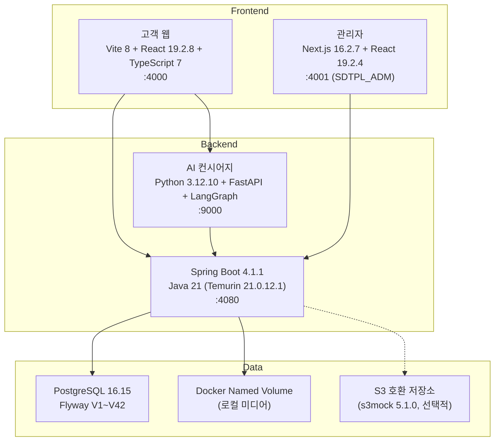

# hotelChainManager 프로젝트 분석

> 최종 갱신: 2026-09-18 · 분석 대상 리비전: `b6bf628` + 미커밋 작업 (고객 예약 변경 환불 대상 거래 선택)

## 프로젝트 개요

**STAY HANEUL** — React·Spring Boot 기반 호텔 체인 예약·운영 플랫폼 및 AI 예약 컨시어지.

| 항목 | 내용 |
|---|---|
| **대상 지점** | 속초, 설악산, 제주도 (3개 지점, 각 3~4개 객실 유형) |
| **고객 흐름** | 호텔 탐색 → 검색/AI 상담 → 테스트 결제 → 예약 조회·취소·변경 |
| **직원 흐름** | 예약 확인 → 객실 배정 → 체크인 → 체크아웃 → 청소 완료 |
| **브랜드명** | STAY HANEUL (가상) |
| **언어** | 한국어·영어 (CMS 다국어 독립 발행) |

---

## 기술 스택



---

## 디렉터리 구조

```
hotelChainManager/
├── apps/web/                   # 고객 웹 (Vite + React + TS)
│   ├── src/
│   │   ├── App.tsx             # 라우팅·메인 앱
│   │   ├── styles.css          # 전체 스타일
│   │   ├── components/         # 18개 컴포넌트
│   │   └── lib/                # 유틸리티
│   └── test/                   # Playwright E2E (3개)
│
├── SDTPL_ADM/                  # 관리자 (Next.js + React)
│   ├── src/app/
│   │   ├── login/              # 직원 로그인
│   │   └── (dashboard)/        # 대시보드 레이아웃
│   ├── src/components/         # 210개 컴포넌트
│   │   ├── hotel-admin/        # 24개 호텔 운영 컴포넌트
│   │   ├── layout/             # 사이드바·헤더
│   │   └── ui/                 # 공통 UI 컴포넌트
│   └── e2e/                    # Playwright E2E (79개)
│
├── services/api/               # Spring Boot API (Maven)
│   └── src/main/java/team/hotelchain/   # 228개 Java 파일
│       ├── config/             # 설정
│       ├── hotel/              # 호텔·지점
│       ├── inventory/          # 재고·요금
│       ├── operations/         # 객실 운영 (체크인/아웃/청소/상태)
│       ├── payment/            # 결제 (fake + Toss)
│       ├── reservation/        # 예약 핵심
│       ├── reservationchange/  # 예약 변경·승인·정산
│       ├── staff/              # 직원 인증·권한
│       ├── storage/            # 미디어 저장소 (local/mirror/s3)
│       ├── web/                # 공개 웹 API
│       └── webcontent/         # CMS 콘텐츠·미디어·번역 (78개 파일, 최대 영역)
│   └── src/test/java/          # 38개 테스트 파일
│
├── services/concierge/         # AI 컨시어지 (Python)
│   └── app/
│       ├── main.py             # FastAPI 진입점
│       └── graph.py            # LangGraph 대화 그래프 (112라인)
│   └── tests/test_graph.py
│
├── docs/                       # 문서
│   ├── overview/               # 프로젝트 개요·현재 상태
│   ├── architecture/           # 설계 문서
│   ├── changes/                # 변경 기록 (48개)
│   ├── decisions/              # 의사결정 로그
│   └── diagrams/               # 다이어그램
│
├── compose.yaml                # Docker Compose (db, db-test, api, concierge, s3mock)
└── scripts/                    # 유틸리티 스크립트
```

---

## 데이터베이스 스키마 (Flyway V1~V42)

| 버전 | 영역 | 설명 |
|---|---|---|
| V1 | 기반 | 베이스라인 |
| V2 | 재고 | 호텔·객실 유형·일별 재고/요금 |
| V3 | 예약 | 예약·일별 요금·관리 토큰 |
| V4~V5 | 결제/취소 | 테스트 결제·취소 |
| V6~V7 | 직원 | 접근 권한·객실 운영 |
| V8~V19 | CMS | 웹 콘텐츠·페이지 트리·미디어 카탈로그·수명주기·이력·redirect·영구 삭제 |
| V20~V24 | 다국어 | 번역·검토·승인·역할·저장 초안 미리보기 |
| V25~V27 | 미디어 | 비동기 WebP variant·제약·claim |
| V28~V33 | 예약 관리 | 검색 인덱스·취소/정정/배정/인원/일정 변경 감사 |
| V34~V35 | 변경 승인 | 예약 변경 승인·차액 정산 기반 |
| V36~V37 | 객실 운영 | 판매 중지·점검 상태·투숙 중 이동 |
| V38~V42 | 결제 연동 | Toss 결제·안전 장치·정산 명령·전화번호·고객 셀프 변경 |

---

## 주요 구현 완료 기능

### 🔵 고객 웹 (`:4000`)
- 호텔 탐색·날짜/인원/지역 검색·요금제 비교
- 전용 예약 여정: 검색 → checkout → 완료 (URL에는 검색 조건만 보관)
- 테스트 결제 (fake + Toss 위젯)·예약 확정
- 동일 브라우저 예약 관리·조회·취소
- **고객 셀프서비스 예약 변경** (2026-09-15): 일정·객실·요금제·인원 재견적, 차액 결제·환불·0원 변경
- CMS 기반 히어로·콘텐츠·경험·오퍼 페이지
- 한국어·영어 다국어 (Pretendard 폰트, 로컬 가변 다이나믹 서브셋)
- 반응형 헤더·모바일 대응 (390×844 검증)
- SEO 메타데이터 (canonical, OG)
- `<picture>`·`srcset` 반응형 미디어
- 저장 초안 URL 미리보기 (10분 검토)
- AI 컨시어지 패널 연동

### 🟢 관리자 (`:4001`)
- 직원 로그인·세션·역할별 접근 제어 (HQ_ADMIN / HQ_EDITOR / HQ_PUBLISHER / 지점 직원)
- 당일 운영: 도착·출발·청소 업무·체크인/아웃·노쇼
- 객실 배정·재배정·투숙 중 객실 이동
- 객실 운영 상태 (청소·점검·판매 중지, 감사 이력)
- 예약 관리: 조회·상세·취소·정보 정정·인원/일정/객실 변경
- 예약 변경 승인 대기열 (지점 10만원 이내 / 본사 초과, 권한 분리)
- CMS: 페이지 트리·편집기·발행·이력·비교·복원·미리보기·부모 이동·redirect
- 미디어: 업로드·카탈로그·비동기 variant·파일 교체·일괄 교체·저장소 점검·영구 삭제
- 다국어: 영어 번역·검토·승인·발행 (역할 분리, 자가 승인 서버 거부)

### 🔴 Spring Boot API (`:4080`)
- 호텔·객실 유형·재고·요금 관리
- 예약: 임시 확보 → 결제 → 확정 (DB 트랜잭션·멱등 키·관리 토큰 해시)
- 결제: fake provider + Toss 테스트 결제 (승인·환불·UNKNOWN 보존)
- 취소: 정책 기반 환불·재고 복구·처리 직원 감사
- 직원 인증: bcrypt 해시·세션·지점 권한 서버 검증
- 객실 운영: 배정·체크인/아웃·청소·점검·판매 중지·이동
- 예약 변경: 견적·역할별 승인·차액 정산·outbox lease·멱등·잔액 기반 환불 대상 거래 선택 (원결제 또는 변경 추가 결제)
- 고객 셀프 변경: 관리 토큰·변경 가능 조건·재고 잠금 후 재검증
- CMS: 페이지 CRUD·발행·버전·미디어·번역·검토·미리보기·redirect
- 미디어: 업로드·비동기 WebP variant worker·provider 중립 저장소 (local/mirror/s3)

### 🟡 AI 컨시어지 (`:9000`)
- FastAPI + LangGraph 기반 대화 그래프
- 한국어 조건 패턴 추출
- Spring Boot 검색 API 연동 (실제 재고·가격만 반환)
- 고객 웹 검색 바 조건 전달·적용·요청 순서 보호

---

## 개발 환경

| 항목 | 값 |
|---|---|
| **JDK** | Temurin 21.0.12.1 |
| **Python** | 3.12.10 |
| **Node.js** | pnpm 워크스페이스 |
| **DB 개발** | PostgreSQL `:55432` |
| **DB 테스트** | PostgreSQL `:55433` (tmpfs) |
| **컨테이너** | Docker Compose |
| **포트** | 고객 웹 4000 · 관리자 4001 · API 4080 · AI 9000 · s3mock 59090 (선택) |

---

## 검증 상태 요약

> 상세 검증 결과와 미검증 범위는 [현재 개발 상태](../overview/current-development-context.md)와 각 [변경 기록](../changes/)을 따른다.

| 영역 | 검증 수단 | 최근 확인 |
|---|---|---|
| Spring Boot API | PostgreSQL 통합 테스트 (38개 테스트 파일) | 2026-09-18 |
| 관리자 UI | Playwright Chromium E2E 79개 + TypeScript | 2026-09-15 |
| 고객 웹 | Playwright E2E 3개 + production build + 직접 계약 테스트 25개 | 2026-09-18 |
| 결제 | 실제 Toss 위젯 테스트 결제·전액 환불·재고 반환 (2026-09-14) | 2026-09-14 |
| AI 도우미 | headless 고객 웹 대화→적용→재검색 (예약 생성 없이) | 2026-09-10 |

**미검증 항목 (사용자 소유 범위)**: 브라우저·UI 전체 회귀, 라이브 PG 승인/추가 결제/부분 환불/webhook, 운영 다중 인스턴스 장기 부하, CDN·객체 저장소 운영 연동.

---

## 다음 작업 (문서 기준)

1. **운영 결제 provider 선정** — secret·서명 webhook·sandbox transaction·수수료/회계 reconciliation·고객 링크 자동 전달
2. **저장 초안 미리보기** — 실제 10분 만료 시간 경과 검증
3. **AI 도우미 강화** — LLM·정책 임베딩·영구 고객 대화 E2E suite
4. **CMS 확장** — CDN·객체 저장소, 언어별 임의 slug, 예약 발행

---

## 핵심 설계 원칙

> [!IMPORTANT]
> - 객실 유형별 **일자 재고**와 **실제 객실 번호**는 분리 관리
> - **가격·재고·예약 확정 권한**은 Spring Boot에 있음 — AI는 조회 결과만 안내
> - **재고 확보**는 전부 성공 또는 전부 취소 (원자적), 음수 불가
> - 숙박 재고는 체크인일 이상·체크아웃일 미만 (지점 현지 날짜, Asia/Seoul)
> - 직원 **지점 접근 제한**은 서버에서 검증
> - 체크아웃 후 청소 필요 상태 자동 전환, 투숙·청소 상태 분리 관리
> - 예약 당시 **일별 가격·통화·인원·요금제·취소 정책** 보존
> - OTA·도어록·여권 수집·복잡한 회계·매출 최적화는 첫 버전에서 제외
