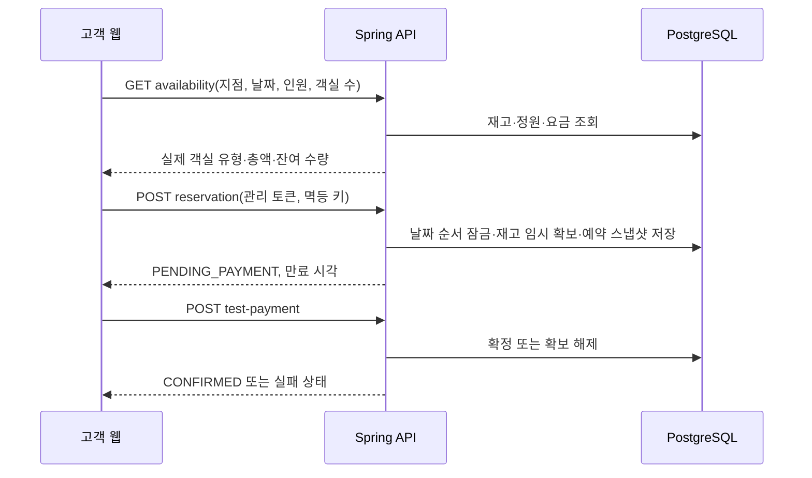

# 호텔 체인 통합 웹사이트·예약·운영 관리 플랫폼 전체 구현 설계서

최종 갱신: 2026-09-11

## 1. 목적과 제품 경계

`STAY HANEUL`은 속초·설악산·제주도 3개 지점을 운영하는 가상 호텔 체인의 고객 예약 웹, 지점 직원 운영 화면, 본사 관리 CMS, AI 예약 컨시어지를 하나로 연결하는 포트폴리오 플랫폼이다.

고객은 지점을 탐색하고 실제 판매 가능 객실을 검색해 테스트 결제로 예약·조회·취소한다. 지점 직원은 예약을 실제 객실 번호에 배정하고 체크인·체크아웃·청소 상태를 처리한다. 본사는 고객 웹 콘텐츠와 지점·요금·직원 권한을 관리한다. AI는 자연어 조건을 해석하고 실제 검색 API 결과만 제안한다.

첫 버전에서 OTA 연동, 도어록, 여권/신분증 수집, 실제 PG 결제, 복잡한 회계·수익 최적화는 다루지 않는다.

## 2. 사용자와 권한

| 사용자 | 주요 목적 | 허용 범위 |
| --- | --- | --- |
| 고객 | 호텔 탐색·검색·예약·취소 | 공개 콘텐츠 조회, 본인 브라우저 세션의 예약 관리 |
| 지점 직원 | 당일 도착·출발·객실·청소 관리 | 소속 지점 운영 데이터와 업무 처리 |
| 본사 관리자 | 체인 운영·고객 웹 발행 | 모든 지점 운영 조회, 고객 웹 콘텐츠 저장·발행 |
| 본사 에디터 | 고객 웹 초안 작성 | 후속 단계에서 초안·검토 요청만 허용 |

서버는 `HQ_ADMIN`과 `BRANCH_STAFF`의 권한을 확인한다. 브라우저에 저장하는 직원 세션과 비회원 예약 관리 토큰은 서버에 원문을 보관하지 않는다.

## 3. 서비스 구성과 포트

| 서비스 | 기술 | 포트 | 책임 |
| --- | --- | --- | --- |
| 고객 웹 | React, TypeScript, Vite | 4000 | 탐색·예약 UI, AI 대화, 발행 콘텐츠 표시 |
| 관리자 | Next.js, React, 제공 테마 | 4001 | 직원 운영, 본사 CMS와 운영 관리 |
| 핵심 API | Spring Boot, PostgreSQL | 4080 | 인증, 재고·가격·예약·결제·운영·CMS 권한 |
| AI 컨시어지 | FastAPI, LangGraph | 9000 | 조건 추출, 누락 질문, 실제 검색 API 조회 |
| 데이터베이스 | PostgreSQL | 55432 개발, 55433 테스트 | 예약·운영·직원·CMS 데이터 |

서비스 관계는 [플랫폼 구조도](../diagrams/hotel-platform.json), 고객 여정은 [고객 여정 구조도](../architecture/lotte-resort-inspired-customer-journey.html), CMS 구조는 [웹 콘텐츠 플랫폼 구조도](../architecture/web-content-platform.html), 현재 제공 기능과 API·운영 규칙은 [CMS 기능 명세](cms-functional-specification.md)를 따른다. 롯데리조트급 콘텐츠 운영으로의 재정의와 구현 전제는 [롯데리조트급 CMS 기능 설계](lotte-resort-level-cms-functional-design.md)에 기록한다.

## 4. 고객 웹 정보 구조

### 4.1 공통 구조

- 상단: 브랜드, 객실·경험·오퍼·예약 메뉴, 예약 조회, 언어 선택.
- 지점 랜딩: 목적지 히어로, 핵심 소개, 경험 카드, 오퍼, 도착 안내.
- 예약 바: 지점, 단일 달력의 체크인·체크아웃 범위, 성인·아동·객실 수, 검색 버튼.
- 객실 결과: 객실 유형·요금제·조식 여부·잔여 객실·숙박 총액·선택 버튼.
- 예약 정보: 예약자 이름·이메일, 임시 확보, 테스트 결제, 예약 조회·취소.
- AI 예약 도우미: 자연어 입력, 실제 후보 표시, 현재 예약 조건 전달, 적용 시 Spring 최신 availability 재조회.

### 4.2 홈페이지 CMS

홈페이지는 `website_page`의 단일 `HOME_PAGE`로 운영한다. `hotelId`와 부모는 `null`, 경로는 `/`, slug는 `home`, 메뉴 노출은 `false`로 고정하며 공개 navigation에는 넣지 않는다. 본사만 홈 전용 초안 조회·저장·발행·버전 조회 API를 사용할 수 있고, 일반 페이지 발행 API는 홈을 발행하지 못한다.

고객 루트는 발행되고 문서 검증을 통과한 홈 문서를 `CMS HERO → 코드 소유 예약 검색·AI → CMS TEXT/CTA → 기존 지점 경험·오퍼·객실·도착 안내` 순서로 표시한다. 예약 검색·재고·가격·결제의 소유권은 CMS로 옮기지 않는다. 홈 문서 조회나 검증에 실패하면 정적 홈 fallback을 유지한다.

### 4.3 지점 콘텐츠

고객 콘텐츠는 지점별로 히어로, 소개, 경험, 오퍼, 도착 안내를 가진다. 발행 경로는 `/stays/sokcho`, `/stays/seoraksan`, `/stays/jeju`이며 고객 웹은 공개 페이지 resolve API가 반환한 발행 콘텐츠와 `hotelId`를 사용한다. 이 `hotelId`만 기존 예약 검색 API로 넘긴다. 제목이 유효하지 않거나 API가 일시적으로 실패하면 지역별 정적 기본값을 보완해 예약 흐름을 막지 않는다.

공개 메뉴는 발행된 메뉴 항목만 반환하며, 고객 웹의 지점 링크와 예약 CTA는 `/stays/:slug#booking`을 사용한다. 가격·잔여 객실·예약 토큰·고객 정보는 URL이나 CMS 콘텐츠에 넣지 않는다. Vite 개발 서버에서는 history fallback이 동작하지만, 실제 정적 배포에서는 non-asset 요청을 `index.html`로 보내는 rewrite가 필요하다.

### 4.4 일반 콘텐츠 페이지

브랜드 이야기·캠페인처럼 특정 호텔 예약과 연결되지 않는 콘텐츠는 `CONTENT_PAGE`로 운영한다. 첫 범위에서는 `/brand` 같은 `SECTION`의 직계 자식만 만들며, `hotelId`는 `null`이다. 고객 웹은 `/brand/story`처럼 최대 두 단계의 공개 경로를 resolve API로 읽고, 일반 페이지에는 지점 랜딩용 예약 바를 표시하지 않는다.

문서는 `seo`와 `blocks`로 한정한다. `blocks`는 첫 번째이자 유일한 `HERO`, 선택 `TEXT`와 `CTA`로 구성되며, 서버와 고객 웹이 각각 허용 목록과 필드 길이를 검사한다. 이미지 경로는 `/images/` 아래의 안전한 정적 경로만 사용하고, CTA는 `/`, `/#fragment`, 또는 안전한 로컬 경로만 사용한다. HTML, Markdown, 스크립트, 원격 URL은 저장·렌더링하지 않는다.

관리자는 저장·발행 전 `CONTENT_PAGE`를 읽기 전용 preview dialog로 확인할 수 있다. 이 화면은 현재 폼 메모리의 페이지 정보와 HERO·TEXT·CTA를 고객 웹과 유사한 위계로 표현하며, 저장·발행·보관·복원 요청을 만들지 않는다. 이미지도 고객 파서와 같은 내장 `/images/...` 또는 UUID가 일치하는 업로드 전달 경로만 고객 웹 origin에서 표시한다. 인증된 공개 초안 URL이나 SEO head 미리보기는 별도 후속 범위다.

영구 삭제는 보관된 `CONTENT_PAGE`에만 제공한다. 서버는 lifecycle·draft·published version을 모두 확인하고, page-scoped 미디어 사용 위치·발행 snapshot·감사 이력부터 정리한 뒤 page를 삭제한다. 자산 파일과 자산 카탈로그는 남는다. 활성 페이지, 지점 랜딩, 고정 홈, SECTION과 하위 페이지를 자동으로 삭제하지 않으며, 미래 트리에서 자식이 있는 page는 충돌로 거부한다.

### 4.5 반응형과 접근성

- 900px 이하: 예약 바는 2열, 600px 이하: 1열로 전환한다.
- 달력·인원·AI 패널은 키보드 포커스와 명시적 닫기·선택 동작을 제공한다.
- 버튼, 입력 필드, 상태 메시지에 접근 가능한 이름과 `aria-live` 또는 `role=status`를 사용한다.
- 모바일 390×844 및 전체 예약 만료 흐름은 후속 실제 검증 항목이다.

## 5. 예약 도메인 설계

### 5.1 핵심 개념

판매 단위는 `객실 유형(room_type)`이고, 체크인 때 배정하는 단위는 `실제 객실(physical_room)`이다. 이 둘을 분리해 객실 유형의 일자 재고 판매와 프런트의 객실 번호 운영을 동시에 표현한다.

| 데이터 | 핵심 값 | 역할 |
| --- | --- | --- |
| hotel | 지점·지역·시간대 | 체인 지점 |
| room_type | 객실 유형·최대 정원 | 판매 단위 |
| rate_plan / rate_day | 요금제·일자별 금액·정책 버전 | 가격 계산 원본 |
| inventory_day | 판매 가능 수량·임시 확보·확정 수량 | 일별 재고 |
| reservation / reservation_night | 일정·인원·총액·일별 요금·정책 | 예약 시점 스냅샷 |
| physical_room | 실제 객실 번호·청소 상태 | 현장 운영 단위 |
| reservation_room_assignment | 예약과 실제 객실의 관계 | 체크인 배정 |

### 5.2 고객 예약 흐름

### 5.3 재고와 금액 규칙

- 재고는 체크인일 이상 체크아웃일 미만의 각 현지 날짜에 적용한다.
- 다박·다객실 확보는 모든 날짜가 성공하거나 전부 취소한다.
- 예약 요청 금액은 신뢰하지 않는다. 서버가 `rate_day`에서 다시 계산한 금액만 확정한다.
- 검색 응답 총액도 요청 객실 수를 곱한 값으로 반환해 고객 표시 금액과 예약 검증 금액을 일치시킨다.
- 임시 확보 만료, 결제, 취소는 트랜잭션에서 재고를 갱신한다.

### 5.4 상태

| 상태 | 의미 | 다음 상태 |
| --- | --- | --- |
| PENDING_PAYMENT | 객실을 임시 확보하고 결제를 기다림 | CONFIRMED, EXPIRED |
| CONFIRMED | 테스트 결제 성공, 예약 확정 | CANCELLED, CHECKED_IN |
| CANCELLED | 취소·환불 처리 | 종료 |
| EXPIRED | 임시 확보 만료 | 종료 |
| CHECKED_IN | 실제 객실 배정 후 투숙 시작 | CHECKED_OUT |
| CHECKED_OUT | 퇴실 완료 | 종료, 객실은 청소 필요 |
| NO_SHOW | 미도착 처리 | 종료 |

## 6. 지점 운영과 본사 관리

### 6.1 지점 직원

- 당일 도착·출발 예약 목록.
- 예약별 실제 객실 후보 조회와 배정.
- 체크인 전 배정 객실을 같은 호텔·객실 유형의 청결 객실로 한 실씩 변경.
- 체크인: 필요한 수의 청결 객실이 모두 배정된 경우만 처리.
- 체크아웃: 배정 객실을 `NEEDS_CLEANING`으로 전환.
- 하우스키핑 완료: 객실을 `CLEAN`으로 전환.
- 노쇼 처리.

다객실 예약은 예약 상세에서 남은 객실을 한 실씩 배정한다. 기존 배정 객실 변경도 예약 상세에서 한 실씩 처리하며 예약·현재 객실·신규 객실 잠금, 숙박 기간 충돌 재검증, 멱등 키와 직원 감사 이력을 적용한다.

### 6.2 본사

본사 관리자는 모든 지점을 조회하며 다음 영역을 관리한다.

- 지점, 객실 유형, 요금제, 판매 중지.
- 직원 계정과 지점 접근 권한.
- 지점별 예약·매출·점유·취소 지표.
- 고객 웹 CMS, 발행 이력과 미디어.
- 공통 정책과 지점별 예외.

현재는 직원 세션, 지점 권한, 당일 운영 API, CMS 1단계 기반이 구현되어 있다. 지점별 경영 지표, 요금 편집, 정책 관리 UI는 후속 범위다.

## 7. 고객 웹 CMS 설계

### 7.1 운영 목표

CMS는 본사가 개발자 도움 없이 지점 랜딩, 오퍼, 안내, 캠페인 페이지를 운영하는 도구다. 롯데리조트 수준의 운영을 목표로 페이지·블록·미디어·다국어·SEO·발행 통제를 단계적으로 구현한다.

### 7.2 구현 단계

| 단계 | 범위 | 상태 |
| --- | --- | --- |
| 1 | 지점 콘텐츠 문서, 초안·발행본, 버전·감사 로그, 본사 권한, 관리자 편집기 | V8 초기 이관·공개 조회와 본사 발행·권한 검증 완료 |
| 2 | 지점 랜딩 페이지 트리·슬러그·메뉴, 지점 콘텐츠 폼과 SEO | V9 완료 |
| 3 | `SECTION` 직계 일반 콘텐츠 페이지, 구조화 HERO/TEXT/CTA, page ID API, 고객 공개 경로 | V10 코드·E2E·빌드와 로컬 API·고객 직접 경로·실제 관리자 CMS 트리 검증 완료 |
| 4 | 루트 단일 `HOME_PAGE`, 홈 전용 본사 API, 고정 홈 leaf, 고객 홈 CMS 렌더링 | V11 대상 테스트·Docker Flyway·실제 본사 API·고객/관리자 브라우저 검증 완료 |
| 5 | 자산 카탈로그·안전한 업로드·자산 사용 위치·메타데이터·보관/복원, 페이지 수명주기, 발행본 콘텐츠 초안 복원·비교, 현재 일반 페이지 초안 미리보기·영구 삭제, 페이지 이동·깊은 트리, 예약된 발행 | V12에서 카탈로그·업로드·사용 위치, V13에서 자산 이름·기본 alt·참조 보호 보관/복원과 재검증 캐시, V14에서 `CONTENT_PAGE` 공개 중단·초안 복원, V15에서 이전 발행본 콘텐츠의 초안 복원, V16에서 두 immutable snapshot의 읽기 전용 비교, V17에서 저장 전 일반 페이지 preview, V18에서 보관 페이지의 history/audit/usage 영구 정리와 페이지 이동·깊은 트리, V19에서 30일 유예 기반 업로드 자산 영구 삭제를 완료. 파일 교체·예약 발행·블록 이동 감지는 계획 |
| 6 | 다국어·번역 승인, 다단계 검토, CDN 무효화, 외부 자산 저장소 | 계획 |

### 7.3 CMS 데이터와 발행 규칙

- `website_page`: 페이지 유형·부모·지점, 초안/발행 슬러그·경로·메뉴·콘텐츠·버전과 `CONTENT_PAGE`의 `ACTIVE`/`ARCHIVED` 수명주기의 기준 데이터. 보관 상태여도 초안·경로·발행 이력은 유지한다.
- `website_page_version`: 경로·메뉴·콘텐츠를 포함한 발행 시점의 불변 스냅샷.
- `website_page_audit`: 생성·저장·발행·이관·보관·복원·발행본 콘텐츠 복원의 작성자와 시각.
- `website_media_asset`: 고객 문서가 참조하는 UUID, 내장·업로드 출처, 불변 공개 전달 경로, 이미지 메타데이터·기본 alt·`ACTIVE`/`ARCHIVED` 상태·낙관적 버전을 소유한다. 내장 속초 해안 이미지 UUID는 `14000000-0000-0000-0000-000000000001`이다.
- `website_media_usage`: 페이지·초안/발행 상태·필드 경로별 자산 UUID와 페이지별 alt를 기록한다. 사용 위치는 저장·발행 성공 뒤 같은 트랜잭션에서 갱신한다.
- `hotel_web_content`와 그 이력 테이블: V9 이관 원본이자 기존 호텔 콘텐츠 API의 호환 facade이다. 고객과 관리 endpoint는 새 랜딩 페이지를 읽고 쓴다.
- 공개 고객 웹은 발행본만 읽는다.
- 저장·발행은 `HQ_ADMIN`만 수행하며 지점 직원 요청은 서버에서 거부한다.
- `CONTENT_PAGE`는 `SECTION`의 직계 자식이고 `hotel_id`는 `NULL`이다. 생성·저장·발행은 `CREATED`·`DRAFT_SAVED`·`PUBLISHED` 감사 로그를 남기며, 초안/발행 버전이 양수이고 일치할 때만 반영한다. 보관·복원은 별도 수명주기 버전과 현재 초안/발행 버전을 함께 검사한다. V15의 발행본 복원은 같은 세 버전 조건과 `sourceVersion < publishedVersion` 조건에서 source snapshot의 `content`만 `draft_content`로 복사하고 `draft_version`을 올린다. URL·메뉴·부모·공개본은 유지하며 `VERSION_RESTORED` audit과 `DRAFT` 미디어 usage를 갱신한다. V16 비교 API는 같은 `CONTENT_PAGE`의 양수이고 오름차순인 두 version snapshot만 반환한다. `ACTIVE`·`ARCHIVED` 모두 허용하며 현재 활성 미디어 검증, URL 정규화, audit·usage·초안·공개본 변경은 수행하지 않는다. 관리자는 이미지 preview 없이 metadata·SEO·HERO·TEXT·CTA의 필드를 나란히 표시한다. V18 영구 삭제는 `ARCHIVED CONTENT_PAGE`와 세 version 일치, 자식 없음 조건에서 usage·version·audit·page를 순서대로 정리하고 자산은 유지한다. 보관은 공개 본문·메뉴와 `PUBLISHED` 미디어 usage만 제거하므로 복원 후에도 본사가 다시 발행해야 고객에 노출된다.
- 일반 페이지 문서는 `seo`와 `HERO`·`TEXT`·`CTA` allowlist 블록만 사용한다. HERO는 `imageAssetId`, 서버 정규화 `imageSrc`, 페이지별 `imageAlt`를 함께 가진다. 지점 랜딩은 같은 역할의 `heroAssetId`, `heroImage`, `heroAlt`를 쓴다.
- 서버는 활성 미디어 자산만 허용하고 제출된 전달 경로가 해당 자산의 불변 경로와 일치하는지 확인한다. 페이지 저장의 활성 자산 검사는 `FOR KEY SHARE`, 미디어 보관·복원은 `FOR UPDATE`를 사용하고 초안·발행 사용 위치가 하나라도 있으면 미디어 보관을 거부한다. 업로드 공개 응답은 `max-age=0, must-revalidate`로 재검증을 요구한다. 보관된 업로드 전달은 404이며, 고객 parser는 같은 UUID의 `/images/...` 또는 `/api/website/media/{uuid}/content`만 렌더링하고 원격·data·상위 이동 경로를 거부한다.
- `HOME_PAGE`는 root `/`에 한 개만 존재하며 `hotel_id`·`parent_id`는 `NULL`이다. 홈의 slug·경로·메뉴 노출·순서는 서버가 고정하고, 저장 요청은 `content`와 `expectedDraftVersion`만 받는다. 일반 page publish endpoint는 `HOME_PAGE`를 명시적으로 거부한다.
- 홈과 일반 페이지의 문서 계약은 같은 `seo`와 `HERO`·`TEXT`·`CTA` allowlist를 사용한다. 고객은 `HOME_PAGE`의 `hotelId: null`과 유효 문서만 루트 화면에 적용한다.
- 개발 프로필의 반복 마이그레이션은 3개 지점 랜딩을 새 페이지 트리에 생성한다. 기존 운영자 편집을 덮어쓰지 않으며, 초기 기준 버전에는 발행자 원문을 만들지 않는다.

## 8. AI 예약 컨시어지

### 8.1 역할 경계

- LangGraph: 대화 상태, 조건 추출, 누락 질문, 검색·추천 단계 전환.
- FastAPI: `/chat`과 `/health`, Spring API 호출.
- Spring Boot: 객실·재고·가격·예약 가능 여부의 유일한 권한.
- 고객 웹: 추천 후보 표시와 검색 조건 적용. 예약 생성·결제는 기존 예약 화면만 수행.

### 8.2 대화 흐름

1. 고객 입력에서 지역, 날짜, 숙박일, 성인·아동·객실 수, 조식 조건을 추출한다.
2. 지점·체크인·체크아웃·성인 수가 없으면 필요한 조건을 묻는다.
3. 조건이 완성되면 호텔 목록과 판매 가능 객실 API를 조회한다.
4. 조식 조건을 필터링하고 최대 세 후보를 고객에게 제안한다.
5. 고객이 조건 적용을 선택하면 예약 바에 반영하고 Spring availability를 직접 다시 요청한다. 이 응답만 예약 카드에 사용하며, 조건 변경 뒤 늦게 도착한 이전 요청은 무효화한다.

현재는 외부 LLM 키 없이 정해진 한국어 패턴을 사용한다. LLM·임베딩을 도입해도 가격·재고를 생성하거나 예약을 확정할 수 없다.

## 9. API 설계

### 9.1 공개 API

| 메서드 | 경로 | 목적 |
| --- | --- | --- |
| GET | `/api/hotels` | 지점 목록 |
| GET | `/api/availability` | 실제 판매 가능 객실 검색 |
| POST | `/api/reservations` | 임시 확보 예약 생성 |
| GET | `/api/reservations/{id}` | 관리 토큰 기반 예약 조회 |
| POST | `/api/reservations/{id}/test-payment` | 테스트 결제 |
| POST | `/api/reservations/{id}/cancel` | 예약 취소 |
| GET | `/api/hotels/{hotelId}/content` | 지점별 CMS 발행본 |
| GET | `/api/website/navigation` | 발행·메뉴 노출 페이지 트리 |
| GET | `/api/website/pages/resolve?path=/`, `/stays/sokcho` 또는 `/brand/story` | 발행된 고객 페이지. 호텔 랜딩만 예약용 `hotelId`를 가지며 `HOME_PAGE`와 일반 페이지는 `null` |
| GET | `/api/website/media/{mediaId}/content` | 업로드 자산의 공개 이미지 전달. 내장 자산은 `/images/...`를 사용 |

### 9.2 직원·본사 API

| 메서드 | 경로 | 권한 |
| --- | --- | --- |
| POST | `/api/staff/sessions` | 로그인 |
| GET | `/api/staff/me` | 활성 세션 |
| GET | `/api/staff/hotels/{hotelId}/operations` | 본사 또는 소속 지점 |
| GET | `/api/staff/hotels/{hotelId}/reservations?date=&query=&status=` | 본사 또는 소속 지점. 기준일 관련 예약을 최대 200건 조회 |
| GET | `/api/staff/reservations/{id}/cancellation-preview` | 본사 또는 예약 지점. 저장 정책 기준 취소 가능 여부·예상 환불 조회 |
| POST | `/api/staff/reservations/{id}/cancel` | 본사 또는 예약 지점. 멱등 키로 취소·환불·재고 복구 후 직원 감사 기록 |
| PATCH | `/api/staff/reservations/{id}/guest` | 본사 또는 예약 지점. 확정 예약의 이름·이메일만 멱등 정정하고 직원 감사 기록 |
| POST | `/api/staff/reservations/{id}/assignments` | 본사 또는 소속 지점 |
| GET | `/api/staff/reservations/{id}/room-reassignment-options` | 본사 또는 예약 지점. 현재 배정과 같은 유형의 변경 후보 조회 |
| PATCH | `/api/staff/reservations/{id}/assignments/{physicalRoomId}` | 본사 또는 예약 지점. 확정 예약의 객실 한 실을 멱등 변경하고 직원 감사 기록 |
| PUT | `/api/staff/web-content/hotels/{hotelId}` | 본사만 |
| POST | `/api/staff/web-content/hotels/{hotelId}/publish` | 본사만 |
| GET | `/api/staff/web-content/hotels/{hotelId}/versions` | 본사만 |
| GET | `/api/staff/website/pages` | 본사만, 초안 기준 페이지 트리 |
| GET | `/api/staff/website/home` | 본사만, 고정 홈 초안 조회 |
| PUT | `/api/staff/website/home` | 본사만, 고정 홈 콘텐츠 초안 저장 |
| POST | `/api/staff/website/home/publish` | 본사만, 고정 홈 버전 조건 발행 |
| GET | `/api/staff/website/home/versions` | 본사만, 고정 홈 발행 이력 |
| POST | `/api/staff/website/pages` | 본사만, `SECTION` 아래 일반 페이지 생성 |
| GET | `/api/staff/website/pages/{pageId}` | 본사만, 일반 페이지 초안 조회 |
| PUT | `/api/staff/website/pages/{pageId}` | 본사만, 일반 페이지 초안·메뉴·경로 저장 |
| POST | `/api/staff/website/pages/{pageId}/publish` | 본사만, 버전 조건 발행 |
| POST | `/api/staff/website/pages/{pageId}/archive` | 본사만, `CONTENT_PAGE` 공개 중단과 수명주기 버전 조건 보관 |
| POST | `/api/staff/website/pages/{pageId}/restore` | 본사만, `CONTENT_PAGE` 초안 복원과 수명주기 버전 조건 |
| POST | `/api/staff/website/pages/{pageId}/versions/{sourceVersion}/restore-draft` | 본사만, 현재 `publishedVersion`보다 이전인 발행본 콘텐츠만 현재 초안으로 복원. lifecycle·draft·published 버전 조건 |
| GET | `/api/staff/website/pages/{pageId}/versions` | 본사만, 일반 페이지 발행 이력 |
| GET | `/api/staff/website/media?includeArchived=true` | 본사만, 기본 활성 자산 또는 보관 자산을 포함한 카탈로그와 사용 수 |
| POST | `/api/staff/website/media` | 본사만, PNG/JPEG multipart 업로드 |
| PATCH | `/api/staff/website/media/{mediaId}` | 본사만, 이름·기본 alt의 버전 조건 저장 |
| POST | `/api/staff/website/media/{mediaId}/archive` | 본사만, 참조 0건 자산 보관 |
| POST | `/api/staff/website/media/{mediaId}/restore` | 본사만, 보관 자산 복원 |
| GET | `/api/staff/website/media/{mediaId}/usages` | 본사만, 초안·발행 사용 위치 |

### 9.3 AI API

| 메서드 | 경로 | 목적 |
| --- | --- | --- |
| GET | `:9000/health` | 서비스 상태 |
| POST | `:9000/chat` | 조건 대화와 실제 후보 조회 |

## 10. 보안과 데이터 보호

- 예약 관리 토큰은 브라우저에서 32바이트 난수로 만들고 API는 SHA-256 해시만 저장한다.
- 예약 생성은 관리 토큰·멱등 키·요청 본문 지문을 사용해 중복 요청을 방지한다.
- 직원 비밀번호는 BCrypt 해시로 저장하고 세션 토큰도 해시로 저장한다.
- 본사 CMS 발행 권한은 클라이언트 UI가 아니라 Spring API에서 확인한다.
- CMS 문서는 자유 이미지 URL을 저장하지 않는다. 서버는 카탈로그 자산 UUID와 정확한 전달 경로를 검증하고, 고객 웹은 HTML 삽입 없이 allowlist 텍스트·링크·이미지 경로만 다시 렌더링한다.
- 실제 결제 정보, 여권, 카드 정보, 외부 서비스 비밀값은 저장하지 않는다.
- 업로드는 ImageIO 실제 PNG/JPEG 판별·디코드, 최대 10 MiB·24 MP, UUID 파일 키, `nosniff` 공개 전달을 적용한다. 참조 없는 자산의 보관·복원은 구현했지만 물리 파일은 유지한다. 바이러스 검사·EXIF 제거·변환·CDN·객체 저장소·영구 삭제·파일 교체는 후속 단계다.

## 11. 검증 전략

| 변경 영역 | 필수 검증 |
| --- | --- |
| 재고·예약·결제 | PostgreSQL 통합 테스트, 실제 API 한 건 |
| 고객 UI | `pnpm build`, 핵심 브라우저 상호작용, 모바일 확인 |
| 직원 운영 | 지점 권한·배정·체크인·체크아웃·청소 API 통합 테스트 |
| CMS | 서버 통합 테스트, 본사 저장·발행·버전 API, 지점 직원 403, 관리자 E2E, 고객 웹 빌드와 발행 주소 새로고침 반영 |
| AI | 조건 추출 단위 테스트, 실제 검색 API와 후보 금액·재고 비교 |

불필요한 전체 재검증보다 변경한 도메인의 테스트와 실제 상호작용을 우선한다. 검증하지 못한 항목은 변경 기록에 남긴다.

## 12. 구현 순서와 완료 기준

1. **CMS 1단계 핵심 완료**: 지점 랜딩·일반 페이지·홈페이지의 관리자 실행·빌드, 본사 저장·발행·고객 반영, 지점 권한·편집·동시 발행 보완과 V12 미디어 카탈로그·업로드·사용 위치, V13 자산 메타데이터·참조 보호 보관/복원·재검증 캐시, V14 일반 페이지 보관·초안 복원, V15 이전 발행본 콘텐츠의 안전한 초안 복원, V16 발행 snapshot 비교, V17 저장 전 일반 페이지 preview, V18 보관된 일반 페이지의 page-scoped 이력·사용 위치 영구 정리를 완료했다. 페이지 이동·깊은 트리·자산 영구 삭제·다국어·예약된 발행은 다음 확장 단계다.
2. **운영 완성**: 다객실 배정·객실 변경, 지점 권한과 당일 업무의 실제 관리자 검증.
3. **고객 완성**: 모바일·만료·예약 복구 E2E, 다국어 콘텐츠 표시.
4. **CMS 확장**: 페이지 이동·깊은 트리, 보관된 업로드 자산 영구 삭제·파일 교체, 범용 블록·다국어, 인증 미리보기, 예약된 발행·블록 이동 감지.
5. **AI 확장**: LLM·정책 검색을 추가하되 실제 재고·가격 API 권한을 유지.
6. **본사 운영 확장**: 요금·판매 중지·정책·지표·직원 계정 UI.

각 단계는 데이터 모델, API, UI, 대상 검증, 변경 기록을 함께 완료해야 다음 단계로 이동한다.
