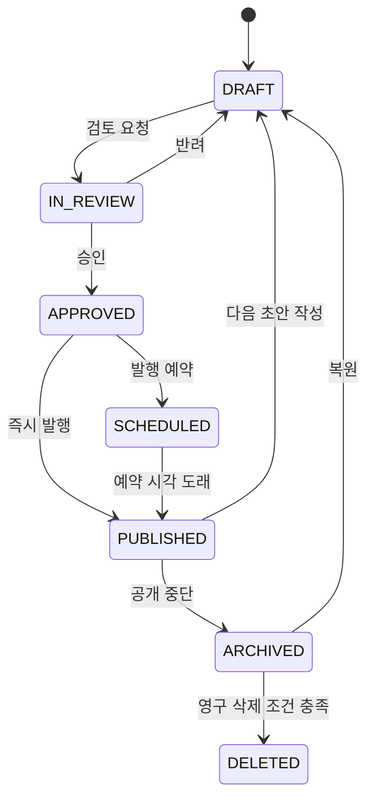

# 롯데리조트급 콘텐츠 운영 CMS 기능 설계

최종 갱신: 2026-09-11  
상태: **설계 완료, 구현 대기**  
적용 대상: 고객 웹 `4000`, 본사 관리자 `4001`, Spring API `4080`

## 1. 재정의 이유

기존 CMS는 홈·지점 랜딩·브랜드 일반 페이지를 초안과 발행본으로 관리하는 기반이다. 일반 페이지는 `HERO`, `TEXT`, `CTA`만 허용하므로 리조트 사이트에 필요한 객실, 다이닝, 부대시설, 프로모션의 목록과 상세 페이지를 운영할 수 없다.

이 설계의 목표는 롯데리조트 속초 사이트처럼 고객이 지점을 선택한 뒤 객실·다이닝·시설·경험·프로모션·이용 안내를 탐색하고, 각 상세 페이지에서 예약으로 자연스럽게 이동하도록 만드는 것이다. 디자인을 복제하지 않으며 정보 구조와 운영 수준을 STAY HANEUL의 브랜드·서비스 경계에 맞게 구현한다.

현재 CMS의 초안/발행 분리, 본사 권한, 낙관적 버전, 발행 snapshot, 감사 이력, 자산 UUID 참조, 안전한 이미지 전달, 보관/복원 규칙은 유지한다. 기존 `CONTENT_PAGE`와 공개 URL은 호환 데이터로 이관한다.

## 2. 제품 경계

| CMS가 소유하는 정보 | 예약 도메인이 소유하는 정보 |
| --- | --- |
| 소개 문구, 사진·alt·캡션, 객실·시설·프로모션 상세, 운영 시간, 혜택 문구, 이용 안내, SEO, 메뉴, 번역, 발행 일정 | 지점, 실제 판매 객실 유형, 일자별 재고, 실시간 가격, 요금제, 예약 가능 여부, 결제, 취소·환불, 객실 배정 |

CMS의 `최저가`, 혜택, 판매·투숙 기간은 마케팅 표시 정보다. 예약 버튼을 누른 뒤 보이는 가격·재고·판매 가능 객실은 Spring 예약 API가 매번 계산한다. CMS가 예약 확정·재고 차감·가격 덮어쓰기를 수행하지 않는다.

## 3. 목표 정보 구조

### 3.1 고객 공개 경로

| 영역 | 목록 경로 | 상세 경로 | 대표 콘텐츠 |
| --- | --- | --- | --- |
| 홈 | `/` | - | 체인 소개, 지점 진입, 시즌 캠페인, 예약 검색 |
| 지점 | `/stays/{hotelSlug}` | - | 지점 히어로, 핵심 경험, 최근 프로모션, 도착 안내 |
| 객실 | `/stays/{hotelSlug}/rooms` | `/stays/{hotelSlug}/rooms/{roomSlug}` | 객실 비교, 사진, 정원·면적·전망, 어메니티, 예약 CTA |
| 다이닝 | `/stays/{hotelSlug}/dining` | `/stays/{hotelSlug}/dining/{venueSlug}` | 레스토랑 소개, 메뉴 안내, 운영 시간, 위치, 예약·문의 |
| 부대시설 | `/stays/{hotelSlug}/facilities` | `/stays/{hotelSlug}/facilities/{facilitySlug}` | 수영장·스파·라운지 등 시설 소개, 운영 시간·이용 규정 |
| 경험 | `/stays/{hotelSlug}/experiences` | `/stays/{hotelSlug}/experiences/{experienceSlug}` | 지역 체험, 계절 프로그램, 이용 조건, 연결 CTA |
| 프로모션 | `/offers` | `/offers/{offerSlug}` | 기간, 대상 지점·객실, 혜택, 표시 가격, 유의사항, 예약 CTA |
| 이용 안내 | `/guides` | `/guides/{guideSlug}` | 체크인, 교통, 주차, FAQ, 정책, 공지 |
| 브랜드 | `/brand` | `/brand/{pageSlug}` | 브랜드 스토리, 지속가능성, 캠페인 |

프로모션은 단일 지점과 여러 지점 모두 대상으로 할 수 있으므로 체인 공통 `/offers/{offerSlug}`을 canonical URL로 사용한다. 지점 랜딩과 지점별 프로모션 목록은 같은 상세 페이지로 연결한다. 같은 프로모션을 지점 경로에 복제하지 않는다.

### 3.2 공개 메뉴

상단 메뉴는 `숙소`, `객실`, `다이닝`, `부대시설`, `경험`, `프로모션`, `이용 안내`, `브랜드`를 기본으로 한다. 각 지점에 적용되지 않는 메뉴는 해당 지점의 공개 메뉴에서 숨긴다. 메뉴 노출 여부·순서·번역·발행 상태는 페이지와 별도로 발행 snapshot에 포함한다.

## 4. 콘텐츠 유형

기존의 `HOME_PAGE`, `SECTION`, `HOTEL_LANDING`, `CONTENT_PAGE` 구분은 하위 호환을 위해 남긴다. 새 모델은 `content_kind`를 추가해 편집 폼, 필수 블록, 목록 카드, 고객 렌더러를 결정한다.

| `content_kind` | 소유 범위 | 필수 구성 | 예약 연결 |
| --- | --- | --- | --- |
| `HOME` | 체인 | 히어로, 지점·프로모션 컬렉션, 예약 검색 구역 | 코드 소유 예약 바 |
| `DESTINATION` | 지점 | 히어로, 소개, 핵심 카드, 추천 콘텐츠, 도착 안내 | 지점 고정 검색 |
| `ROOM` | 지점 + `room_type` 1개 | 갤러리, 요약, 객실 사양, 어메니티, 안내, 예약 CTA | room type을 예약 검색 필터에 전달 |
| `DINING` | 지점 | 갤러리, 소개, 운영 시간, 위치, 메뉴/예약 안내, 공지 | 외부 예약은 안전한 내부 안내 경로만 연결 |
| `FACILITY` | 지점 | 갤러리, 시설 사양, 운영 시간, 위치, 이용 규정 | 시설 예약 안내 또는 문의 CTA |
| `EXPERIENCE` | 지점 | 프로그램 소개, 일정·대상·정원 안내, 이미지, 관련 시설·프로모션 | 객실 검색 또는 내부 상세 CTA |
| `PROMOTION` | 하나 이상 지점 | 판매·투숙 기간, 혜택, 대상, 표시 가격, 약관, 예약 CTA | 현재 선택 조건으로 예약 검색 |
| `GUIDE` | 체인 또는 지점 | 안내 문서, 표, FAQ, 지도, 관련 링크 | 필요 시 예약 또는 문의 CTA |
| `BRAND` | 체인 | 브랜드 서사, 갤러리, 카드, CTA | 내부 경로 CTA |

`ROOM`은 실제 판매 단위 `room_type`과 1:1로 연결한다. 객실 소개용 문구·사진·어메니티는 CMS가 관리하지만 정원·판매 가능 여부·가격은 예약 도메인의 값을 표시하거나 예약 화면에서 재조회한다. `PROMOTION`은 여러 지점과 다수 객실 유형을 연결할 수 있다.

## 5. 재사용 블록 계약

자유 HTML, Markdown, 스크립트와 외부 이미지 URL은 계속 허용하지 않는다. 관리자는 JSON을 직접 편집하지 않고 유형별 폼을 사용한다. 모든 블록은 stable block ID를 가지므로 이동·비교·번역 상태를 식별할 수 있다.

| 블록 | 핵심 필드 | 사용 예 |
| --- | --- | --- |
| `HERO` | 제목, 설명, 대표 이미지, focal point, CTA | 모든 상세 페이지 첫 구역 |
| `RICH_TEXT` | 상단 문구, 제목, 문단, 강조 문장 | 브랜드·객실·시설 소개 |
| `IMAGE_GALLERY` | 2~12개 자산, alt, 캡션, 순서 | 객실·다이닝·시설 사진 |
| `FEATURE_GRID` | 2~6개 아이콘/이미지 카드, 제목, 설명, 링크 | 핵심 경험, 패키지 혜택 |
| `SPEC_TABLE` | 행 제목·값·보조 설명 | 객실 면적·정원·전망, 시설 정보 |
| `OPERATING_HOURS` | 요일별 시간, 휴무일, 위치, 연락처, 예외 안내 | 다이닝·시설 |
| `LOCATION` | 주소, 좌표, 주차/이동 문구, 내부 지도 링크 | 시설·도착 안내 |
| `ACCORDION` | 질문/제목, 답변, 순서 | 객실 이용 안내, FAQ, 취소 규정 |
| `NOTICE_LIST` | 제목, 항목, 중요도 | 유의사항, 시즌 운영 공지 |
| `PROMOTION_SUMMARY` | 판매·투숙 기간, 대상 지점·객실, 혜택, 표시 가격, 태그 | 프로모션 상세의 핵심 정보 |
| `RELATED_COLLECTION` | 대상 콘텐츠 종류, 수동 선택 또는 지점/태그 필터, 최대 수 | 관련 객실·시설·프로모션 카드 |
| `BOOKING_CTA` | 문구, 지점, 선택 room type/프로모션, 기본 인원, 내부 URL | 객실·프로모션 예약 진입 |

블록별 제목·설명·항목 수·문자 수 상한은 서버 validator와 고객 parser에 같은 계약으로 둔다. 이미지 블록은 `assetId`, 서버가 정규화한 전달 경로, 문맥별 alt·캡션을 함께 저장한다. 화면에서 필요한 카드·목록 데이터만 별도 read model로 공개한다.

## 6. 콘텐츠와 운영 데이터 모델

### 6.1 페이지와 트리

| 모델 | 역할 | 주요 규칙 |
| --- | --- | --- |
| `website_page` | 페이지 식별자, 부모, 경로, 초안/발행 메타데이터와 문서, 버전 | 현재 테이블을 기반으로 확장. 각 페이지는 하나의 canonical path를 가짐 |
| `website_page_relation` | 관련 페이지, 지점·프로모션 표시 대상, 수동 카드 순서 | 페이지 간 순환 참조 금지, 대상 공개 상태 확인 |
| `website_page_room_type` | `ROOM`과 실제 `room_type` 연결 | 지점과 room type의 소속이 일치해야 함 |
| `website_page_hotel` | `PROMOTION` 등 다지점 대상 연결 | 하나 이상 지점, 지점 삭제·비활성 상태를 고려 |
| `website_page_version` | 발행 시점의 불변 snapshot | 콘텐츠·메뉴·경로·번역 상태·연결 대상 snapshot 보존 |
| `website_page_audit` | 작성·검토·발행·보관·복원·번역·일정 작업 이력 | 행위자·시각·행위·대상 version 보존 |

트리는 임의 깊이를 허용하되 최대 깊이는 4로 제한한다. 부모 변경은 하위 페이지의 초안 경로를 일괄 재계산하고, 이미 발행된 하위 페이지는 개별 redirect 정책을 확인하기 전에는 이동할 수 없다. 경로 이동, redirect, 메뉴 이동은 한 작업 단위로 version을 확인하고 감사 로그에 남긴다.

### 6.2 번역

`website_page`는 언어와 무관한 identity, 부모·종류·연결 관계를 소유한다. `website_page_translation`은 `ko`, `en`별 초안/발행 slug·경로·메뉴·SEO·블록 문서·초안/발행 version·상태를 소유한다.

- 한국어를 기본 locale로 둔다. 영어는 한국어 발행을 자동 복사하지 않으며 번역 초안으로 시작한다.
- locale마다 독립적으로 저장·검토·발행한다. 한국어를 수정해도 기존 영어 발행본은 자동으로 바뀌지 않는다.
- 번역 누락 시 고객에게 한국어를 무단 노출하지 않는다. 해당 locale의 페이지를 숨기거나 설계된 fallback 안내를 표시한다.
- 이미지 alt·캡션·SEO·운영 시간 설명도 locale별로 관리한다. 숫자·시간대·실제 `room_type` 연결은 언어와 무관하게 공유한다.

### 6.3 미디어

`website_media_asset`는 원본 파일, MIME, 크기, 색상·초점 정보, 보관 상태와 접근 제어를 소유한다. `website_media_variant`는 responsive 크롭·WebP/AVIF 변형과 생성 상태를 소유한다. `website_media_usage`는 페이지·locale·초안/발행·block ID·필드 경로별 사용 위치를 보존한다.

- 원본은 PNG/JPEG 업로드 검사와 UUID storage key 규칙을 유지한다.
- 공개는 발행 페이지에서 참조하는 활성 variant만 허용한다.
- 대체는 새 자산을 만들고 사용 위치를 명시적으로 이동한다. 기존 자산을 덮어쓰지 않는다.
- 참조 0건의 보관 자산만 영구 삭제 후보가 된다. 번들 자산·발행 snapshot이 참조하는 자산·삭제 유예 기간 안의 자산은 삭제하지 않는다.

## 7. 편집·검토·발행 흐름

### 7.1 역할

| 역할 | 권한 |
| --- | --- |
| `HQ_EDITOR` | 콘텐츠·번역·미디어 초안 작성, 검토 요청 |
| `HQ_PUBLISHER` | 검토 승인, 예약 발행, 즉시 발행, 보관, redirect 승인 |
| `HQ_ADMIN` | 위 모든 권한, 유형·지점 연결·권한 정책 관리 |
| `BRANCH_STAFF` | 고객 CMS 읽기·수정·발행 불가 |

영어 번역 검토에는 `HQ_EDITOR`, `HQ_PUBLISHER`를 적용했다. 편집자는 영어 초안 작성·검토 요청, 승인자는 승인·반려·발행을 담당하며 요청자는 자신의 초안을 승인할 수 없다. 한국어와 나머지 CMS 관리 권한 분리는 후속이다.

### 7.2 상태

- `DRAFT`는 고객에게 노출되지 않는다.
- `IN_REVIEW`에서는 작성자가 내용을 수정하면 자동으로 `DRAFT`로 돌아간다.
- `APPROVED` 또는 `SCHEDULED` 발행 직전에 대상 지점, room type, 미디어, 경로 충돌, 번역 상태를 다시 검증한다.
- `PUBLISHED` 페이지를 수정하면 새 초안만 생성된다. 기존 공개 snapshot은 유지된다.
- `ARCHIVED`는 공개 메뉴·resolve·미디어 공개 usage에서 즉시 제외된다. 현재 V18의 보관 원칙을 확장해 모든 새 상세 유형에도 적용한다.

### 7.3 운영 화면

1. **콘텐츠 대시보드**: 지점·유형·언어·상태·발행 예정일 필터, 초안/검토/예약/공개/보관 수치, 작업자별 할 일.
2. **사이트 트리**: 체인 공통과 지점별 트리, 페이지 이동, 메뉴 노출, locale·공개 상태 배지, redirect 영향 표시.
3. **유형별 편집기**: 객실·다이닝·시설·프로모션의 필요한 블록만 제공하며 순서·필수값·연결 대상을 검증.
4. **미디어 라이브러리**: 자산 상태, 사용 위치, alt·캡션, crop/variant, 대체·보관·삭제 유예를 관리.
5. **미리보기**: 데스크톱과 390px 모바일, 한국어/영어, 초안·현재 발행본 비교, URL·SEO·카드 목록 preview.
6. **검토함·발행 캘린더**: diff, 코멘트, 승인/반려, 예약·즉시 발행, 실패 사유와 재시도.
7. **감사 로그**: 누가 어느 locale·필드·연결·발행 일정을 바꿨는지 조회.

## 8. 고객 화면 동작

### 8.1 목록

- 객실·다이닝·시설·경험·프로모션 목록은 지점, 카테고리, 태그, 시즌·판매 상태로 필터링한다.
- 카드에는 대표 이미지, 분류, 제목, 짧은 설명, 핵심 수치 또는 기간, 상태, 상세 링크를 표시한다.
- 프로모션 목록의 최저가는 마케팅 표시 값이며 예약 결과의 가격과 다를 수 있음을 명시한다.
- 빈 목록은 숨겨진 카드나 깨진 섹션 대신 지점별 안내와 관련 콘텐츠를 보여 준다.

### 8.2 상세

- HERO 뒤에는 이미지 갤러리, 구조화 요약, 사양·운영 시간 표, 혜택 카드, FAQ/유의사항, 관련 콘텐츠, 예약 CTA 순서로 렌더링한다.
- 객실 상세 예약 CTA는 지점과 room type만 예약 바에 적용하고 날짜·인원 입력과 실시간 availability 재조회는 고객이 수행한다.
- 프로모션 CTA는 대상 지점·기본 조건을 적용할 수 있으나 할인 가격을 예약 요청에 보내지 않는다.
- 다이닝·시설의 운영 시간은 시간대 `Asia/Seoul`과 휴무·계절 예외를 함께 보인다.
- 모든 이미지에는 페이지 문맥에 맞는 alt가 있고, 갤러리는 키보드·스크린 리더·모바일 swipe를 지원한다.

## 9. 공개 및 관리자 API 원칙

| 범위 | 계약 원칙 |
| --- | --- |
| 공개 navigation | locale와 지점 context를 받으며 발행된 메뉴만 반환 |
| 공개 page resolve | canonical path와 locale로 발행 snapshot·SEO·콘텐츠·연결 대상만 반환 |
| 공개 collection | 지점·유형·태그·page 상태를 검증한 카드 read model만 반환 |
| 공개 media | 활성 발행 usage가 있는 안전한 variant만 전달 |
| 관리자 page API | identity, 번역, 블록, 연결, 상태, version을 명시적으로 분리해 저장 |
| 관리자 schedule/review API | 작성자·승인자·예정 시각·대상 version을 요구하고 결과를 audit에 남김 |
| 예약 API | CMS 입력을 신뢰하지 않고 지점·room type·날짜·인원으로 재계산 |

모든 변경 요청은 낙관적 version과 서버 권한 확인을 사용한다. 페이지와 자산이 연결된 저장·발행·보관·삭제는 트랜잭션에서 정합성을 보장한다. 공개 API는 초안, 내부 ID, 관리자 코멘트, 미발행 번역을 반환하지 않는다.

## 10. URL 변경과 SEO

- 발행된 경로를 변경하면 기존 canonical URL은 `website_redirect`에 영구 또는 종료일이 있는 `301` 규칙으로 저장한다.
- redirect source와 target은 같은 locale이며 순환·다단계 redirect를 허용하지 않는다.
- 페이지별 title, description, canonical, Open Graph image·title·description, robots, structured data 타입을 locale별 발행본에 저장한다.
- `ROOM`, `DINING`, `FACILITY`, `PROMOTION`은 각각 적합한 JSON-LD를 사용하되 실제 가격·재고를 CMS의 정적 structured data로 만들지 않는다.
- sitemap은 공개·색인 허용 상태의 발행 page만 locale별로 생성한다.

## 11. 데이터 안전과 품질 기준

- 서버와 고객 parser가 같은 allowlist·길이·로컬 링크·자산 참조 규칙을 적용한다.
- 외부 URL, iframe, 임의 HTML, script, inline event handler를 저장·렌더링하지 않는다.
- 새 block type, page kind, locale, redirect, media variant는 migration과 read/write validator와 테스트를 함께 추가한다.
- 고객 공개는 발행 snapshot과 활성 미디어로만 이루어진다. 저장 실패·동시 수정·예약 발행 실패는 공개본을 바꾸지 않는다.
- 관리자 UI는 키보드 조작, 명확한 field label, 오류의 원인·복구 방법, 390px mobile preview를 제공한다.
- 페이지 목록은 필요한 카드 필드만 읽으며 대형 갤러리 원본과 전체 이력을 전달하지 않는다.

## 12. 기존 기능의 이관

| 현재 기능 | 새 모델의 처리 |
| --- | --- |
| `HOME_PAGE` | `content_kind=HOME`, 한국어 발행본으로 이관 |
| 세 지점 `HOTEL_LANDING` | `content_kind=DESTINATION`, 기존 `/stays/*` 경로 유지 |
| `/brand/*` `CONTENT_PAGE` | `content_kind=BRAND` 또는 `GUIDE`, 기존 URL 유지 |
| 기존 HERO/TEXT/CTA | 동명 block으로 보존, 새 block ID 부여 |
| `website_page_version` | 과거 snapshot은 읽기 전용으로 유지하고 새 snapshot schema version을 기록 |
| 기존 미디어 자산·usage | asset UUID 유지, block ID·locale·variant 정보는 migration으로 보완 |
| V14~V18 lifecycle | 보관·복원·비교·영구 삭제 원칙을 새 page kind에 적용하되 type별 삭제 권한을 명시 |

기존 public API와 경로는 새 read model이 준비될 때까지 facade로 유지한다. URL, 고객 공개본, 사용자가 작성한 기존 콘텐츠를 일괄 삭제하거나 재발행하지 않는다.

## 13. 구현 순서와 완료 기준

이 문서는 구현 계획이 아니다. 아래 순서는 이후 기능별 계획을 분리할 때의 의존성 순서다.

1. **콘텐츠 기반**: page identity·content kind·깊은 트리·block ID·읽기 전용 migration·공개 read model.
2. **상세 페이지 기반**: 갤러리·사양 표·운영 시간·FAQ·관련 컬렉션·예약 CTA와 고객/관리자 렌더러.
3. **도메인 연결**: `ROOM`-`room_type`, `PROMOTION`-지점·객실 유형, 다이닝·시설·경험 페이지와 목록 필터.
4. **편집 운영**: 페이지 이동·redirect·미디어 variant·교체·삭제 유예, 비교와 모바일 preview.
5. **다국어와 거버넌스**: locale별 초안/발행, 검토·승인, 예약 발행, sitemap·OG·robots.

완료 판단은 특정 화면이 보이는지로 하지 않는다. 각 단계는 migration, 서버 권한·정합성 테스트, 관리자 E2E, 고객 웹 빌드와 핵심 브라우저 상호작용, 변경 기록을 함께 통과해야 한다. 실제 사용자 페이지·자산은 검증 목적으로 보관·삭제·재발행하지 않는다.

## 14. 설계 산출물

- [목표 구조도](lotte-resort-cms-target.html): 본사 운영, 콘텐츠 모델, 예약 도메인, 고객 공개 경계를 시각화한 Archify artifact.
- [구조도 원본](lotte-resort-cms-target.architecture.json): 구조도 수정용 JSON.
- [현재 구현 CMS 명세](cms-functional-specification.md): 이 설계 이전에 실제 완료된 범위와 API.
- [전체 플랫폼 설계](full-site-implementation-design.md): 예약·직원 운영·AI를 포함한 제품 경계.

Archify artifact는 9개 구조 검사와 1440×900, 1600×1000, 1920×1080, 2048×1320 브라우저 containment 검사를 통과했다. Viewer의 고정 UI는 영어 fallback이며 구조도 본문은 한국어다.
