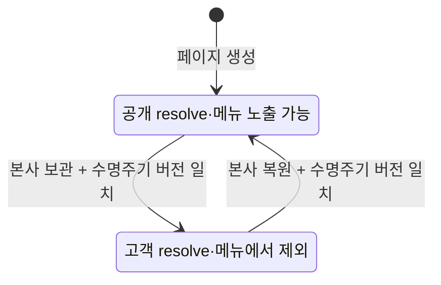

# CMS 일반 페이지 보관·복원 설계

최종 갱신: 2026-09-11

## 목표

본사 관리자가 발행 중인 일반 콘텐츠 페이지를 고객 웹에서 안전하게 내리고, 주소·콘텐츠·발행 이력·미디어 참조를 보존한 채 다시 복원할 수 있게 한다. 영구 삭제나 트리 재구성은 이 단계에서 다루지 않는다.

## 범위와 제외 범위

이번 V14는 `CONTENT_PAGE`만 대상으로 한다.

- 본사만 일반 페이지를 `ACTIVE`와 `ARCHIVED` 사이에서 전환한다.
- 보관 즉시 고객 공개 resolve와 메뉴에서 페이지를 제외한다.
- 복원은 보관 전 초안을 다시 편집 가능한 활성 상태로 되돌린다. 고객 공개는 본사가 내용을 확인한 뒤 다시 발행할 때만 재개한다.
- 보관된 페이지는 관리자 트리에 `보관` 상태로 남고, 본문 편집·저장·발행은 복원 전까지 막는다.
- 페이지 주소는 보관 중에도 유지해 다른 페이지가 같은 URL을 차지하지 못하게 한다.
- 보관은 초안·발행 이력은 보존하지만 현재 공개본과 공개 메뉴 노출을 비운다. 초안 미디어 사용 위치는 유지하고 현재 공개본의 사용 위치만 제거한다.

홈페이지, 지점 랜딩, `SECTION`의 보관·삭제·이동, 상위 변경, 깊은 트리, 물리 삭제, URL 재사용, 버전 복원, 예약 발행은 제외한다.

## 상태와 공개 규칙

`ACTIVE`는 페이지가 발행되었다는 뜻이 아니다. 발행 콘텐츠와 메뉴 노출 설정이 유효한 `ACTIVE` 페이지만 공개 resolve와 navigation에 나타난다. `ARCHIVED`는 보관 시점의 현재 공개본을 비우고 고객 웹에서 제외하지만, 불변 발행 이력과 초안은 남긴다. 복원 뒤에도 현재 공개본은 비어 있으므로 본사가 최신 초안을 명시적으로 발행해야 원래 URL과 메뉴 설정으로 돌아온다.

## 데이터 모델과 동시성

`website_page`에 다음 수명주기 필드를 추가한다.

- `lifecycle_status`: `ACTIVE` 또는 `ARCHIVED`, 기존 행은 모두 `ACTIVE`.
- `lifecycle_version`: 양의 정수, 상태 전환 때만 증가한다.
- `archived_at`, `archived_by`: 현재 보관 상태를 만든 시각과 본사 행위자. 복원하면 비운다.

`website_page_audit.action`은 `ARCHIVED`, `RESTORED`를 허용한다. 감사 details에는 당시 경로와 수명주기 버전을 기록한다.

보관·복원은 대상 페이지 행을 `FOR UPDATE`로 잠그고 수명주기·초안·발행 버전 및 현재 상태를 확인한다. 일반 페이지 저장·발행은 활성 페이지를 `FOR KEY SHARE`로 읽고 상태 조건을 UPDATE에도 포함해 보관과 교차하지 않게 한다. 이미 보관된 페이지의 저장·발행은 `WEBSITE_PAGE_ARCHIVED` 409로 실패하고, 오래된 보관·복원 요청이나 상태 전환 경합은 `WEBSITE_PAGE_LIFECYCLE_CONFLICT` 409로 거부한다. 저장·발행이 먼저 끝나면 오래된 보관 요청은 초안 또는 발행 버전 불일치로 거부한다.

초안의 미디어 사용 위치를 유지하는 이유는 보관된 페이지를 정확히 복원하기 위해서다. 보관 시 현재 공개본 사용 위치만 제거하므로, 현재 초안이 참조한 자산은 자산 보관 대상이 되지 않는다. 과거 발행 스냅샷의 자산 참조는 향후 버전 복원 기능에서 다시 검증한다.

## 서버 API 계약

모든 API는 기존처럼 `HQ_ADMIN`만 허용하며, 지점 직원은 403을 받는다.

| 메서드 | 경로 | 요청 | 결과 |
| --- | --- | --- | --- |
| GET | `/api/staff/website/pages` | 없음 | 활성·보관 일반 페이지를 포함한 관리자 트리. 각 항목은 `lifecycleStatus`, `lifecycleVersion`을 포함 |
| GET | `/api/staff/website/pages/{pageId}` | 없음 | 본사 관리용 초안 문서와 수명주기 상태 |
| POST | `/api/staff/website/pages/{pageId}/archive` | `expectedLifecycleVersion`, `expectedDraftVersion`, `expectedPublishedVersion` | 보관된 페이지와 증가한 수명주기 버전 |
| POST | `/api/staff/website/pages/{pageId}/restore` | `expectedLifecycleVersion`, `expectedDraftVersion`, `expectedPublishedVersion` | 활성 상태의 초안 페이지와 증가한 수명주기 버전 |

보관·복원 대상이 없거나 일반 페이지가 아니면 404를 반환한다. 오래된 수명주기 버전이나 이미 같은 상태인 요청은 `PAGE_LIFECYCLE_CONFLICT` 409를 반환한다. `HOME_PAGE`, `HOTEL_LANDING`, `SECTION`은 보관 API에서 404로 취급해 내부 구조를 변경할 수 없게 한다.

`GET /api/website/pages/resolve`와 `GET /api/website/navigation`은 `lifecycle_status = 'ACTIVE'`만 읽는다.

## 관리자 UX

일반 콘텐츠 편집기의 상단에 페이지 상태를 표시한다.

- 활성 페이지는 `페이지 보관` 버튼을 제공하며, 명시적 확인 대화상자에서 고객 웹 URL과 메뉴에서 즉시 내려간다는 점을 안내한다.
- 보관 페이지는 상태 배지와 보관 사유 안내를 보이고, 편집 폼·미디어 선택·초안 저장·발행을 비활성화한다.
- 보관 페이지는 `초안으로 복원` 버튼으로 다시 편집 가능한 상태가 된다. 복원 자체는 고객 공개를 재개하지 않으며, 본사가 `발행`을 눌러야 한다.
- 관리자 트리는 보관된 페이지도 남겨 관리자가 복원할 수 있게 하며, 일반 공개 메뉴에는 포함하지 않는다.

## 검증 기준

- Spring 통합 테스트로 일반 페이지만 보관 가능한지, 공개 resolve·메뉴에서 즉시 사라지는지, 초안·발행 이력·초안 미디어 사용 위치가 보존되는지, 복원 후 명시적 발행 뒤에만 다시 공개되는지 확인한다.
- 오래된 상태 전환, 보관 중 저장·발행, 본사/지점 권한을 테스트한다.
- 관리자 Playwright로 보관 확인 요청, 보관 상태의 편집 제어 비활성화, 복원 요청과 트리 상태를 확인한다.
- 실제 브라우저에서는 기존 사용자 페이지를 보관하지 않고, CMS의 제어와 기존 공개 경로를 읽기 전용으로 확인한다.
