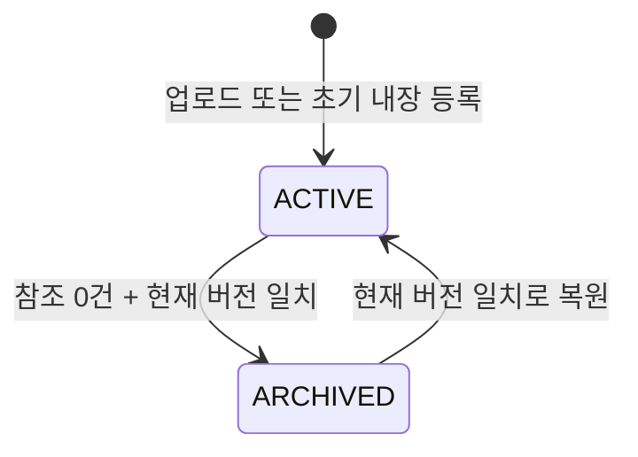

# CMS 미디어 자산 메타데이터·보관 설계

최종 갱신: 2026-09-11

## 목표

본사 관리자가 CMS 미디어 카탈로그 안에서 자산명과 기본 대체 텍스트를 고치고, 현재 페이지에서 쓰지 않는 자산만 보관하거나 다시 활성화할 수 있게 한다. 보관은 실제 파일 삭제가 아니며, 기존 고객 페이지와 예약 흐름을 바꾸지 않는다.

## 배경과 범위

V12는 안전한 업로드, 자산 선택, 페이지별 대체 텍스트, 초안·발행 사용 위치를 구현했다. 자산의 `status`와 `version` 열은 이미 존재하지만, 상태는 `ACTIVE` 하나만 허용하고 관리 API도 없다. 따라서 검증용 업로드와 더 이상 쓰지 않는 이미지가 카탈로그에 계속 남는다.

이번 V13 범위는 다음으로 한정한다.

- 자산명(1~160자)과 기본 대체 텍스트(1~200자)를 본사만 수정한다.
- 자산별 낙관적 버전으로 오래된 편집 저장을 409로 거부한다.
- 초안 또는 발행 문서에서 한 번이라도 쓰는 자산은 보관을 거부한다.
- 참조가 0인 활성 자산은 `ARCHIVED` 상태로 전환한다. 업로드 파일은 보존하고 물리 삭제하지 않는다.
- 보관 자산은 새 페이지 이미지 선택 목록에서 제외하며, 관리자만 조회·메타데이터 수정·복원할 수 있다.
- 보관된 업로드 자산의 공개 전달은 404로 응답한다. 내장 정적 파일 경로는 고객 정적 배포 경로라 서버에서 숨기지 않지만, 보관 뒤 CMS 문서가 새로 참조할 수는 없다.

페이지 삭제·자산 영구 삭제·파일 교체·이미지 변환·다국어 alt·CDN과 외부 저장소는 이번 범위에서 제외한다.

## 상태와 무결성

`website_media_usage`는 초안과 발행 문서를 모두 기록하므로 한 건이라도 있으면 보관할 수 없다. `WebsiteMediaReferenceService`가 페이지 저장 중 활성 자산을 요구할 때 `FOR KEY SHARE` 잠금을 잡고, 보관은 같은 자산을 `FOR UPDATE`로 잠근다. 그러면 페이지 저장과 보관이 교차해 보관 자산이 새 문서에 들어가는 경합을 막는다.

자산 기본 alt는 선택 시 새 페이지 문서에 복사하는 값일 뿐이다. 메타데이터를 수정해도 이미 저장된 `imageAlt`·`heroAlt`와 `website_media_usage.alt_text`는 바뀌지 않는다.

## 데이터베이스

`V13__website_media_archive.sql`은 `website_media_asset.status` 제약을 `ACTIVE`, `ARCHIVED`로 확장한다. 기존 행은 모두 `ACTIVE`로 남는다. 자산 UUID, 전달 경로, 저장 키, 바이트·크기·MIME, 생성자는 수정하지 않는다.

## 서버 API 계약

모든 관리 API는 `HQ_ADMIN`만 사용할 수 있다. 지점 직원은 기존처럼 403을 받는다.

| 메서드 | 경로 | 요청 | 결과 |
| --- | --- | --- | --- |
| GET | `/api/staff/website/media?includeArchived=false` | 선택 사항 | 기본값은 활성 자산만, `true`면 보관 자산도 포함 |
| PATCH | `/api/staff/website/media/{mediaId}` | `displayName`, `defaultAltText`, `expectedVersion` | 갱신된 자산과 증가한 버전 |
| POST | `/api/staff/website/media/{mediaId}/archive` | `expectedVersion` | `ARCHIVED` 자산과 증가한 버전 |
| POST | `/api/staff/website/media/{mediaId}/restore` | `expectedVersion` | `ACTIVE` 자산과 증가한 버전 |

`WebsiteMediaAsset` 응답은 기존 필드에 `status`, `version`을 더한다. `PATCH`, 보관, 복원은 대상이 없으면 404, 버전 또는 현재 상태가 맞지 않으면 `WEBSITE_MEDIA_VERSION_CONFLICT` 409, 사용 위치가 있으면 `WEBSITE_MEDIA_IN_USE` 409을 반환한다.

공개 업로드 전달은 `ACTIVE` 자산만 허용하고 새 응답에는 `Cache-Control: public, max-age=0, must-revalidate`를 보낸다. 따라서 보관 뒤 캐시된 업로드 이미지를 다시 쓸 때도 서버 상태를 재확인한다. 페이지 저장은 활성 자산만 정규화하므로 새 초안·발행 문서가 보관 자산을 참조할 수 없다. 정책 변경 전에 이미 저장된 장기 불변 응답은 서버에서 즉시 회수할 수 없고 자연 만료 전까지 남을 수 있다.

## 관리자 UX

기존 `미디어 선택` 대화상자는 활성 자산만 선택 카드로 표시한다. 선택한 자산에는 다음을 제공한다.

- 현재 자산명·기본 대체 텍스트를 바꾸는 `자산 정보 저장` 폼
- 현재 버전과 사용 위치 수
- 사용 위치가 0일 때만 활성화되는 `보관` 버튼과 명시적 확인 대화상자
- 보관 자산을 펼쳐 보는 목록과 `복원` 버튼

보관된 자산은 선택 확정 버튼을 사용할 수 없다. 사용 중인 자산의 보관 버튼에는 초안·발행 사용 위치를 먼저 해제해야 한다는 설명을 표시한다. 메타데이터 저장과 상태 전환 후 카탈로그·선택 상태를 반환값으로 갱신해 다시 불러오기 전에도 현재 화면을 맞춘다.

## 검증 기준

- Spring 통합 테스트는 본사/지점 권한, 메타데이터 저장과 버전 충돌, 초안·발행 참조가 있는 자산의 보관 거부, 참조 없는 업로드의 보관·복원, 보관 중 공개 업로드 404를 확인한다.
- 관리자 Playwright는 자산 정보 저장 요청, 사용 중 자산의 비활성 보관 제어, 참조 없는 자산의 보관 확인과 복원 요청을 확인한다.
- 기존 미디어 선택·페이지 저장 경로가 활성 자산만 사용함을 타입 검사와 기존 대상 회귀 테스트로 확인한다.
- 실제 브라우저에서는 기존 내장 자산을 수정하거나 보관하지 않고, 기존 사용 위치와 보관 불가 안내만 확인한다. 검증 전용 업로드의 보관은 대상 서버 통합 테스트에서 처리한다.
